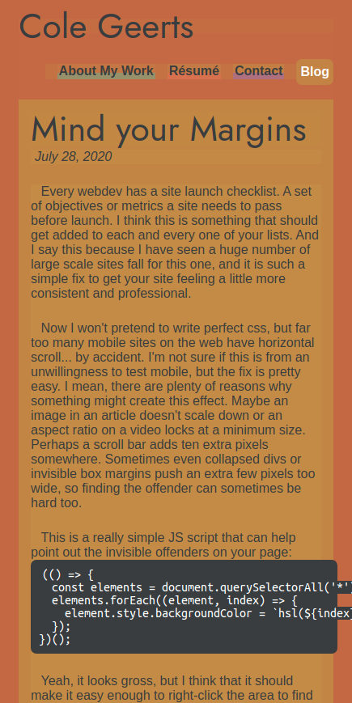

Every webdev has a site launch checklist. A set of objectives or metrics a site needs to pass before launch. I think this is something that should get added to each and every one of your lists. And I say this because I have seen a huge number of large scale sites fall for this one, and it is such a simple fix to get your site feeling a little more consistent and professional.

Now I won't pretend to write perfect css, but far too many mobile sites on the web have horizontal scroll... by accident. I'm not sure if this is from an unwillingness to test mobile, but the fix is pretty easy. I mean, there are plenty of reasons why something might create this effect. Maybe an image in an article doesn't scale down or an aspect ratio on a video locks at a minimum size. Perhaps a scroll bar adds ten extra pixels somewhere. Sometimes even collapsed divs or invisible box margins push an extra few pixels too wide, so finding the offender can sometimes be hard too.

This is a really simple JS script that can help point out the invisible offenders on your page:

```js
(() => {
  const elements = document.querySelectorAll('*');
  elements.forEach((element, index) => {
    element.style.backgroundColor = `hsl(${index}, 50%, 50%)`;
  });
})();
```

Yeah, it looks gross, but I think that it should make it easy enough to right-click the area to find a selector to edit. To use it simply copy & paste it into the console and run it. Anything painted that is too large for the screen is then either forcing outside of its container or one of its children is overflowing its size.

Anyways, the idea doesn't deserve much fan-fare, but maybe I will toss some offenders in the revisions the next time I see one.

_During the testing of this page I found a bug using the script! Screenshot attached:_



_Silly horizontal scroll..._
